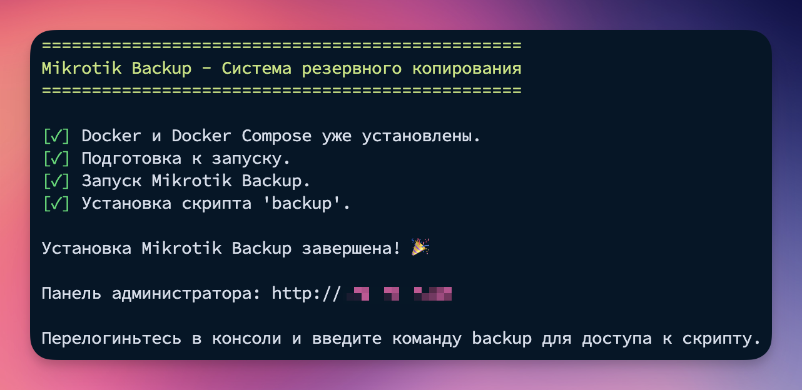
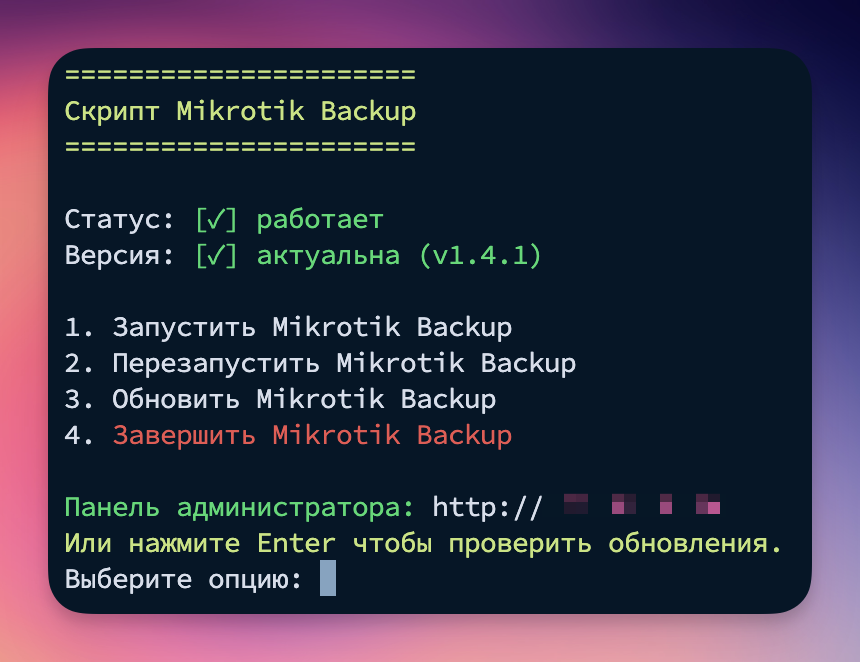
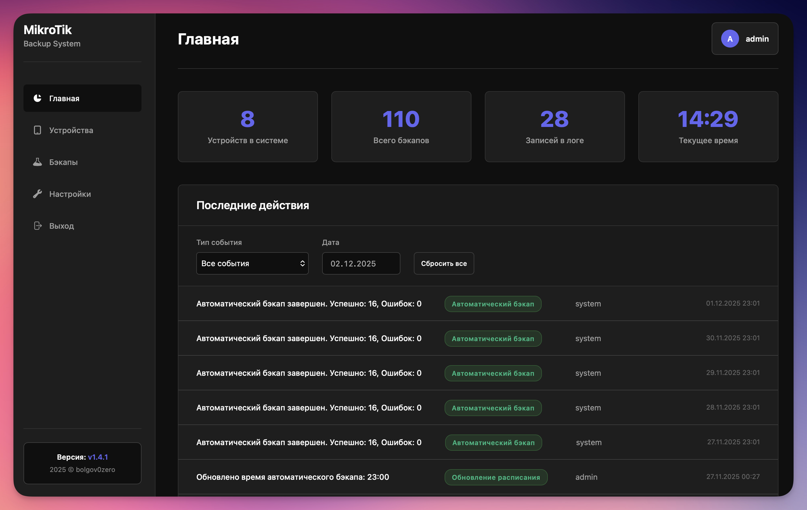
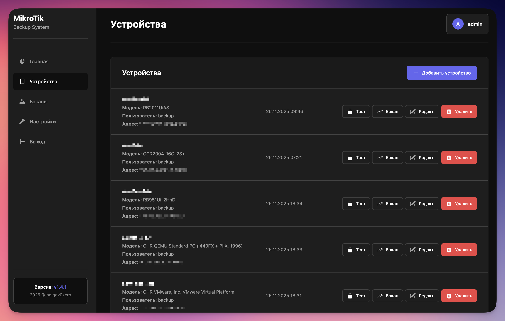
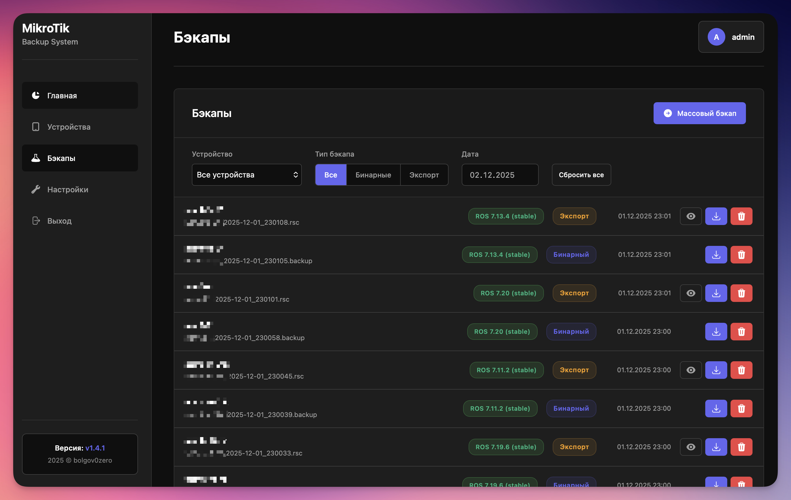
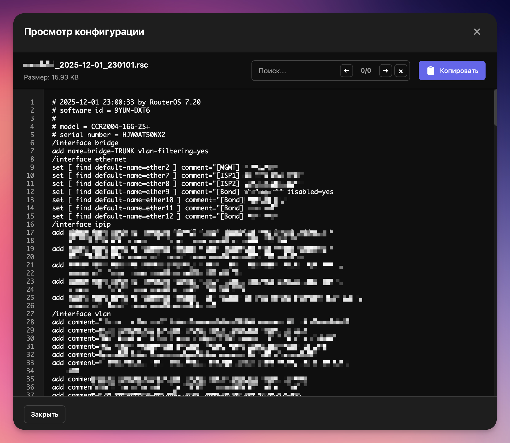
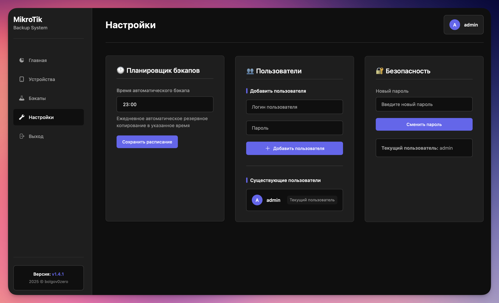

<b>MikroTik Backup</b> — это сервис для сброта резервных копий с роутеров MikroTik.<br/>
Поддерживается Экспорт конфигурации в формате *.rsc и Бинарная резервная копия.<br/>
Для Экспортных резервных копий поддерживается просмотр конфигурации и поиск в ней.


# Установка MikroTik Backup

Установить можно как через скрипт, так и вручную через Docker-Compose.

## 1. Скрипт:
 ```bash
 bash <(wget -qO- https://raw.githubusercontent.com/bolgov0zero/mikrotik-backup/refs/heads/master/backup-install.sh)
 ```
Скрипт установит Docker/Docker compose, установит саму панель и скрипт ads, для удобного управление панелью(запуск, перезапуск, обновление, завершение).

После установки в системе создается учетная запись:
Логин: admin
Пароль: admin
*Поменяйте пароль и создайте другую учетную запись.

  

## 2. Ручная установка(без скрипта backup):

 - Создаем файл docker-compose.yml
 ```bash
 mkdir backup && cd backup && nano docker-compose.yml
```


- Вставляем код
```bash
services:
  mikrotik-backup:
	image: bolgov0zero/mikrotik-backup:latest
	container_name: mikrotik-backup
	ports:
	  - "80:80"
	volumes:
	  - backup_data:/var/www/html/backup
	  - db_data:/var/www/html/db
	restart: unless-stopped

volumes:
  backup_data:
  db_data:
```

- Запускаем
```bash
docker-compose up -d
```

# Скриншоты











